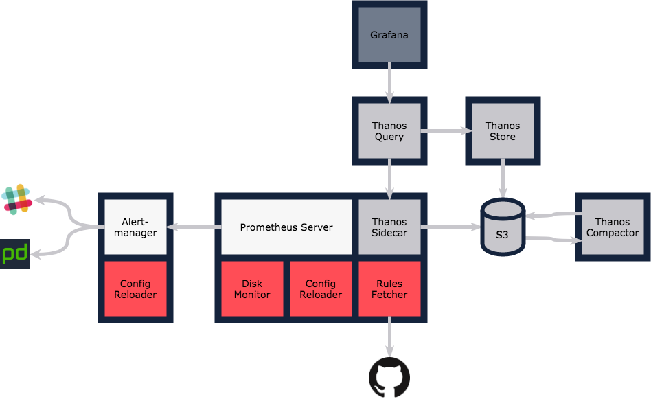

# Thanos

<!-- <KFD-DOCS> -->

Thanos is an opensource Prometheus setup that allows having 2 important features:

1. high availability on Prometheus (setting more Prometheus replicas)
2. long term storage capacity relying on an external object storage

This is the simplified diagram of a Thanos architecture:



## Image repository and tag

- Thanos components versions: `v0.24.0`
- Thanos components image: `registry.sighup.io/fury/thanos/thanos:v0.24.0`

## Setup in Fury Module

We designed 2 different possible setups accordingly with the 2 features listed above:

```bash
thanos #this is the setup with only high-availability feature
thanos-with-store #this include the storing feature with an object storage
thanos-components #this directory contains all the thanos components and is intended to not be used directly
```

So, you'll need to add to your `bases` the `thanos` or `thanos-with-store` depending on your needs.
Remember that `thanos-with-store` is a superset that includes also the high availability feature.

## Caveats

Due to the integration with Prometheus, you have to manually patch some resources to make Thanos work properly

### Prometheus CRD Patch

just create a patch like this that will contain the `thanos` section:

```yml
apiVersion: monitoring.coreos.com/v1
kind: Prometheus
metadata:
    name: k8s
    namespace: monitoring
spec:
    nodeSelector:
        asg_role: infra
    version: v2.16.0
    retention: 15d
    externalUrl: "https://prometheus-example.example.com/"
    externalLabels:
        k8s_cluster: <your cluster name>
    thanos:
        baseImage: thanosio/thanos
        version: v0.20.2
        objectStorageConfig:
            name: thanos
            key: config
```

### Thanos discovery config file

Depending on the number of replicas you choose in the Prometheus section, you'll need to patch the configuration of the query component (see [here](thanos-components/thanos-query/store-sd.yaml)) accordingly to keep it aware of the existing services:

Examples:

1. Prometheus single replica:

```yml
# Store targets for thanos-query to use for searching
- targets:
      # Prometheus sidecars for the short term metrics
      - prometheus-k8s-0.prometheus-operated:10901
```

2. Prometheus 3 replicas

```yml
# Store targets for thanos-query to use for searching
- targets:
      # Prometheus sidecars for the short term metrics
      - prometheus-k8s-0.prometheus-operated:10901
      - prometheus-k8s-1.prometheus-operated:10901
      - prometheus-k8s-2.prometheus-operated:10901
```

> Same example can be done for a solution with store, is just to add to the previous examples the line (see [here](thanos-with-store/store-sd.yaml)) :

`- thanos-store:10901`

If you choose the `thanos-with-store` solution, you need also to add a `secretConfigGenerator` in your kustomization file with proper values:

```yml
secretGenerator:
    # description: config + credentials for access to object storage
    # used-by: Prometheus, Thanos Store, Thanos Compact
    - name: thanos-storage
      type: Opaque
      behavior: replace
      files:
          - config.yaml=thanos-storage-secret.yaml
```

you can see and example of the `thanos-secret.yml` [here](thanos-components/thanos-store/thanos-storage-secret.yaml)

## Ingress

there is no ingress defined by default, but if you want, you can add something like this:

```yaml
apiVersion: extensions/v1beta1
kind: Ingress
metadata:
    name: thanos
    namespace: monitoring
    annotations:
        forecastle.stakater.com/expose: "true"
        forecastle.stakater.com/icon: "https://encrypted-tbn0.gstatic.com/images?q=tbn:ANd9GcRQIi0w9WqMmkCcjgC03kxOFhkdeDuV2UIgKo9xfiugGSjRLxstEw"
        kubernetes.io/ingress.class: internal
        nginx.ingress.kubernetes.io/force-ssl-redirect: "true"
    labels:
        app: thanos-query
spec:
    rules:
        - host: thanos.example.com
          http:
              paths:
                  - path: "/"
                    backend:
                        serviceName: thanos-query
                        servicePort: http
```

<!-- </KFD-DOCS> -->
